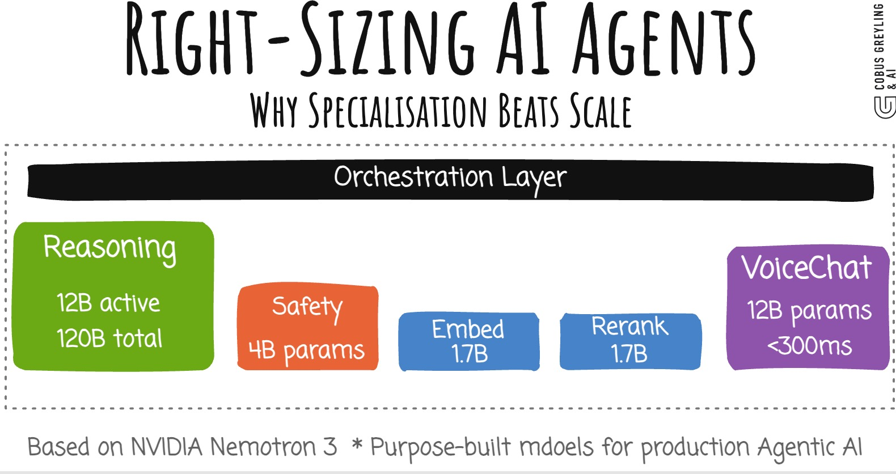
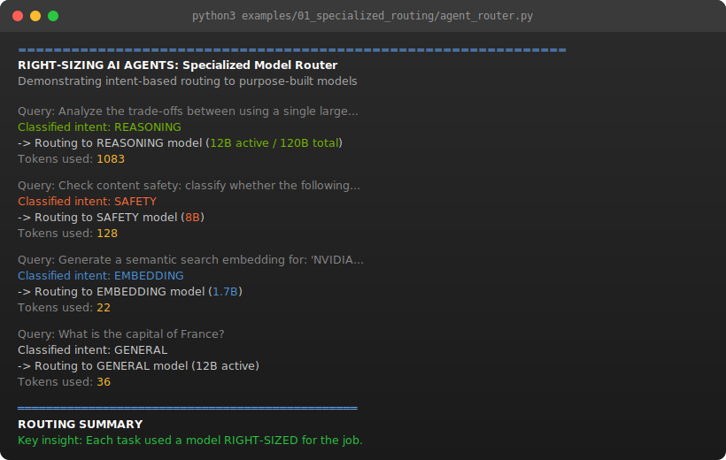
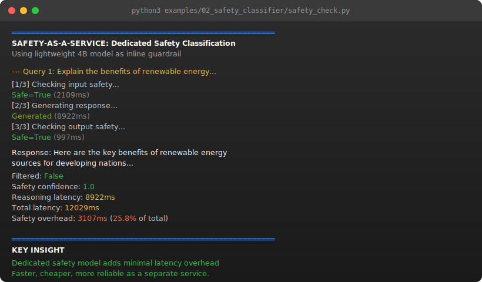
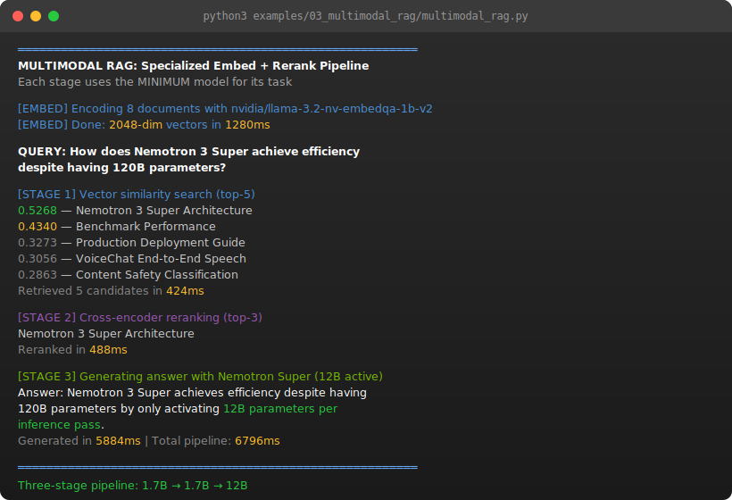
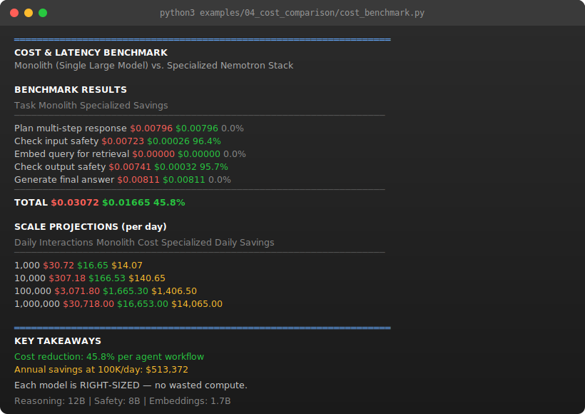

# Right-Sizing AI Agents: Why Specialization Beats Scale

<p align="center">
  
</p>

> **The company that sells bigger GPUs is now advocating for smaller, specialized models.** NVIDIA's Nemotron 3 stack activates only 12B of 120B parameters per call, uses a 4B safety classifier, and 1.7B embedding models. The thesis: production agents make hundreds of calls per task — efficiency per call matters more than raw capability.

[](/blog/right-sizing-ai-agents.md)
[](https://developer.nvidia.com/blog/building-nvidia-nemotron-3-agents-for-reasoning-multimodal-rag-voice-and-safety/)
[](LICENSE)

---

## The Problem

Most developers route every AI task through a single massive model. A customer support agent that needs to:

1. **Understand** the user's question
2. **Retrieve** relevant documents
3. **Reason** about the answer
4. **Check safety** of the response
5. **Generate** a voice reply

...sends all five tasks to the same 400B+ parameter model. This is like using a freight train to deliver a letter.

## The Solution: Specialized Model Stack

NVIDIA's Nemotron 3 family demonstrates a production-ready alternative — purpose-built models, each right-sized for its role:

```
┌─────────────────────────────────────────────────────────┐
│                    AGENTIC AI STACK                     │
├─────────────────────────────────────────────────────────┤
│                                                         │
│  ┌──────────────┐  ┌──────────────┐  ┌───────────────┐  │
│  │  Nemotron 3  │  │  Nemotron 3  │  │  Nemotron 3   │  │
│  │    Super     │  │   Content    │  │   VoiceChat   │  │
│  │  (Reasoning) │  │   Safety     │  │   (Speech)    │  │
│  │   12B active │  │     4B       │  │     12B       │  │
│  └──────┬───────┘  └──────┬───────┘  └──────┬────────┘  │
│         │                 │                 │           │
│  ┌──────┴─────────────────┴─────────────────┴────────┐  │
│  │              Orchestration Layer                  │  │
│  └──────┬─────────────────┬─────────────────┬────────┘  │
│         │                 │                 │           │
│  ┌──────┴───────┐  ┌──────┴──────────┐  ┌───┴─────────┐ │
│  │ Llama Embed  │  │  Llama Rerank   │  │  NeMo Agent │ │
│  │   VL (1.7B)  │  │   VL (1.7B)     │  │  Toolkit    │ │
│  │ (Embeddings) │  │  (Reranking)    │  │ (Profiling) │ │
│  └──────────────┘  └─────────────────┘  └─────────────┘ │
│                                                         │
└─────────────────────────────────────────────────────────┘
```

## What's in This Repo

### Blog Post
- [`blog/right-sizing-ai-agents.md`](/blog/right-sizing-ai-agents.md) — Full article with analysis, diagrams, and references

### Code Examples

| Example | Description | Key Concept |
|---------|-------------|-------------|
| [`01_specialized_routing`](/examples/01_specialized_routing/) | Routes tasks to purpose-built models based on intent | Model specialization |
| [`02_safety_classifier`](/examples/02_safety_classifier/) | Dedicated safety guardrail with Nemotron Content Safety | Right-sized safety |
| [`03_multimodal_rag`](/examples/03_multimodal_rag/) | Visual document retrieval with specialized embed + rerank | Efficient retrieval |
| [`04_cost_comparison`](/examples/04_cost_comparison/) | Token cost and latency analysis: monolith vs. specialized | Why it matters |
| [`05_latency_profiling`](/examples/05_latency_profiling/) | Waterfall trace of multi-step agent calls with timing | Observability |
| [`06_end_to_end_pipeline`](/examples/06_end_to_end_pipeline/) | Full customer support agent using all model tiers | Production pipeline |
| [`07_model_selection_benchmark`](/examples/07_model_selection_benchmark/) | A/B quality comparison: monolith vs. specialized stack | Quality vs. cost |
| [`08_dynamic_routing`](/examples/08_dynamic_routing/) | Adaptive routing based on query complexity scoring | Smart routing |
| [`09_fallback_chains`](/examples/09_fallback_chains/) | Try small model first, escalate if confidence is low | Graceful degradation |
| [`10_batch_processing`](/examples/10_batch_processing/) | Parallel dispatch to specialized models for throughput | Batch throughput |

### Notebook
- [`notebook/right_sizing_demo.ipynb`](/notebook/right_sizing_demo.ipynb) — Interactive Jupyter walkthrough of all examples

### Diagrams
- [`diagrams/`](/diagrams/) — Mermaid source files and rendered SVGs for all architecture diagrams

## Example Output

### 01 — Specialized Routing
Each query is classified and dispatched to the right-sized model:

<p align="center">
  
</p>

### 02 — Safety-as-a-Service
A lightweight safety classifier runs input/output checks with minimal overhead:

<p align="center">
  
</p>

### 03 — Multimodal RAG Pipeline
Three-stage retrieval: Embed (1.7B) → Rerank (1.7B) → Reason (12B):

<p align="center">
  
</p>

### 04 — Cost Benchmark
Side-by-side comparison shows 45.8% cost reduction with specialized models:

<p align="center">
  
</p>

### 05 — Latency Profiling
Waterfall trace showing where time is spent across the specialized model stack:

```
  Span                      Params   Start     Dur  Waterfall
  -------------------------------------------------------------------------
  Input Safety              8B         0ms    85ms  |░░░░                                    |
  Query Embedding           1.7B      85ms    22ms  |    ▒                                   |
  Reasoning & Generation    12B      107ms   890ms  |     ███████████████████████████████████ |
  Output Safety             8B       997ms    78ms  |                                    ░░░░|
  -------------------------------------------------------------------------
  Legend: █ Reasoning  ░ Safety  ▒ Embedding
```

### 06 — End-to-End Pipeline
Complete customer support agent: Intent → Safety → Retrieve → Rerank → Reason → Safety → Respond. One heavyweight reasoning call; everything else uses right-sized specialists.

### 07 — Model Selection Benchmark
A/B quality comparison: identical prompts run through monolith and specialized stack, scored by an LLM-as-judge on relevance, accuracy, and completeness. Shows that specialized models deliver comparable quality at lower cost.

### 08 — Dynamic Routing
Adaptive model selection based on query complexity. Simple factual queries route to lightweight models; multi-step reasoning escalates to larger ones. Complexity is scored locally in microseconds using heuristic signals — no LLM call needed for the routing decision.

### 09 — Fallback Chains
Graceful degradation: queries start at the cheapest model tier. If the model self-reports low confidence, the query escalates to the next tier. Simple queries resolve cheaply; hard queries still get full reasoning power.

### 10 — Batch Processing
Parallel dispatch to specialized models vs. sequential monolith processing. Demonstrates throughput gains when handling many concurrent queries by distributing load across purpose-built model endpoints.

## Quick Start

```bash
# Clone the repo
git clone https://github.com/cobusgreyling/right-sizing-ai-agents.git
cd right-sizing-ai-agents

# Install dependencies
pip install -r requirements.txt

# Set your NVIDIA API key
export NVIDIA_API_KEY="nvapi-your-key-here"

# Launch the interactive Streamlit demo
make run
# Or: streamlit run app.py

# Run individual examples
python examples/01_specialized_routing/agent_router.py
python examples/04_cost_comparison/cost_benchmark.py
python examples/05_latency_profiling/latency_profiler.py
python examples/06_end_to_end_pipeline/full_pipeline.py
python examples/07_model_selection_benchmark/quality_benchmark.py
python examples/08_dynamic_routing/dynamic_router.py
python examples/09_fallback_chains/fallback_chain.py
python examples/10_batch_processing/batch_throughput.py

# Or explore interactively in Jupyter
jupyter notebook notebook/right_sizing_demo.ipynb

# Run tests
make test

# Or use Docker for one-command setup
cp .env.example .env   # add your API key
make docker
```

## Key Insights

| Metric | Monolith (Single 400B+) | Specialized Stack |
|--------|------------------------|-------------------|
| **Params per reasoning call** | 400B+ | 12B active (of 120B) |
| **Params per safety check** | 400B+ | 4B |
| **Params per embedding** | 400B+ | 1.7B |
| **Context window** | 128K typical | 1M tokens |
| **Throughput** | 1x | ~5x (NVFP4 on Blackwell) |
| **Cost per 1K agent tasks** | $$$$$ | $$ |

## The Microservices Analogy

Just as backend engineering evolved from monoliths to microservices — where each service is independently deployable, scalable, and right-sized — AI is undergoing the same evolution:

```
2020: One model to rule them all (GPT-3)
2023: Bigger models, more capabilities (GPT-4, Claude 3)
2025: Specialized stacks for production (Nemotron 3 family)
2026: Right-sized agents as the default architecture
```

## Interactive Demo

The Streamlit app (`app.py`) provides a browser-based UI to explore all four examples interactively. Enter your NVIDIA API key in the sidebar and switch between:

- **Specialized Routing** — type a query and see which model it routes to
- **Safety Classification** — watch the 3-step safety pipeline with live timing
- **RAG Pipeline** — run embed → rerank → reason with real NVIDIA API calls
- **Cost Benchmark** — compare monolith vs. specialized with adjustable scale
- **Latency Profiler** — waterfall trace of a 4-step agent workflow
- **End-to-End Pipeline** — full customer support agent with retrieval and safety
- **Quality Benchmark** — A/B compare monolith vs. specialized with LLM-as-judge scoring
- **Dynamic Routing** — watch complexity scoring route queries to the right model tier
- **Fallback Chains** — see queries escalate (or not) through the model chain
- **Batch Throughput** — compare sequential vs. parallel processing throughput

```bash
streamlit run app.py
```

## Testing

142 unit tests cover the core logic (intent classification, safety parsing, cosine similarity, cost model math, profiling traces, pipeline steps) without requiring API keys:

```bash
make test
```

## References

- [Building NVIDIA Nemotron 3 Agents](https://developer.nvidia.com/blog/building-nvidia-nemotron-3-agents-for-reasoning-multimodal-rag-voice-and-safety/) — Original NVIDIA Developer Blog
- [NVIDIA NeMo Agent Toolkit](https://github.com/NVIDIA/NeMo) — Open-source framework
- [Nemotron 3 on Hugging Face](https://huggingface.co/nvidia) — Model weights and cards

## Author

**Cobus Greyling**

---

*This repo accompanies the blog post ["Right-Sizing AI Agents: Why Specialization Beats Scale"](/blog/right-sizing-ai-agents.md).*
