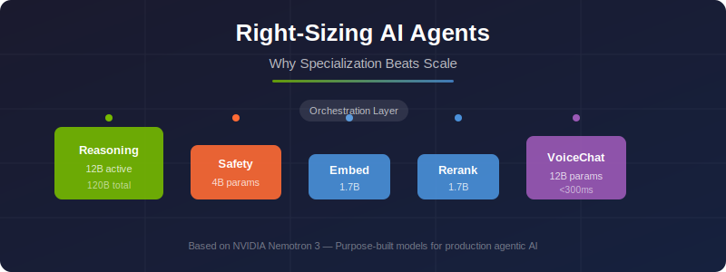

# Right-Sizing AI Agents: Why Specialization Beats Scale

<p align="center">
  
</p>

> **The company that sells bigger GPUs is now advocating for smaller, specialized models.** NVIDIA's Nemotron 3 stack activates only 12B of 120B parameters per call, uses a 4B safety classifier, and 1.7B embedding models. The thesis: production agents make hundreds of calls per task — efficiency per call matters more than raw capability.

[](/blog/right-sizing-ai-agents.md)
[](https://developer.nvidia.com/blog/building-nvidia-nemotron-3-agents-for-reasoning-multimodal-rag-voice-and-safety/)
[](LICENSE)

---

## The Problem

Most developers route every AI task through a single massive model. A customer support agent that needs to:

1. **Understand** the user's question
2. **Retrieve** relevant documents
3. **Reason** about the answer
4. **Check safety** of the response
5. **Generate** a voice reply

...sends all five tasks to the same 400B+ parameter model. This is like using a freight train to deliver a letter.

## The Solution: Specialized Model Stack

NVIDIA's Nemotron 3 family demonstrates a production-ready alternative — purpose-built models, each right-sized for its role:

```
┌─────────────────────────────────────────────────────────┐
│                    AGENTIC AI STACK                      │
├─────────────────────────────────────────────────────────┤
│                                                         │
│  ┌─────────────┐  ┌──────────────┐  ┌───────────────┐  │
│  │  Nemotron 3  │  │  Nemotron 3  │  │  Nemotron 3   │  │
│  │    Super     │  │   Content    │  │   VoiceChat   │  │
│  │  (Reasoning) │  │   Safety     │  │   (Speech)    │  │
│  │   12B active │  │     4B       │  │     12B       │  │
│  └──────┬───────┘  └──────┬───────┘  └──────┬────────┘  │
│         │                 │                 │            │
│  ┌──────┴─────────────────┴─────────────────┴────────┐  │
│  │              Orchestration Layer                   │  │
│  └──────┬─────────────────┬─────────────────┬────────┘  │
│         │                 │                 │            │
│  ┌──────┴───────┐  ┌──────┴──────────┐  ┌──┴─────────┐ │
│  │ Llama Embed  │  │  Llama Rerank   │  │  NeMo Agent │ │
│  │   VL (1.7B)  │  │   VL (1.7B)     │  │  Toolkit    │ │
│  │ (Embeddings) │  │  (Reranking)    │  │ (Profiling) │ │
│  └──────────────┘  └─────────────────┘  └─────────────┘ │
│                                                         │
└─────────────────────────────────────────────────────────┘
```

## What's in This Repo

### Blog Post
- [`blog/right-sizing-ai-agents.md`](/blog/right-sizing-ai-agents.md) — Full article with analysis, diagrams, and references

### Code Examples

| Example | Description | Key Concept |
|---------|-------------|-------------|
| [`01_specialized_routing`](/examples/01_specialized_routing/) | Routes tasks to purpose-built models based on intent | Model specialization |
| [`02_safety_classifier`](/examples/02_safety_classifier/) | Dedicated safety guardrail with Nemotron Content Safety | Right-sized safety |
| [`03_multimodal_rag`](/examples/03_multimodal_rag/) | Visual document retrieval with specialized embed + rerank | Efficient retrieval |
| [`04_cost_comparison`](/examples/04_cost_comparison/) | Token cost and latency analysis: monolith vs. specialized | Why it matters |

### Diagrams
- [`diagrams/`](/diagrams/) — Mermaid source files and rendered SVGs for all architecture diagrams

## Quick Start

```bash
# Clone the repo
git clone https://github.com/cobusgreyling/right-sizing-ai-agents.git
cd right-sizing-ai-agents

# Install dependencies
pip install -r requirements.txt

# Set your NVIDIA API key
export NVIDIA_API_KEY="nvapi-your-key-here"

# Run the specialized routing example
python examples/01_specialized_routing/agent_router.py

# Run the cost comparison
python examples/04_cost_comparison/cost_benchmark.py
```

## Key Insights

| Metric | Monolith (Single 400B+) | Specialized Stack |
|--------|------------------------|-------------------|
| **Params per reasoning call** | 400B+ | 12B active (of 120B) |
| **Params per safety check** | 400B+ | 4B |
| **Params per embedding** | 400B+ | 1.7B |
| **Context window** | 128K typical | 1M tokens |
| **Throughput** | 1x | ~5x (NVFP4 on Blackwell) |
| **Cost per 1K agent tasks** | $$$$$ | $$ |

## The Microservices Analogy

Just as backend engineering evolved from monoliths to microservices — where each service is independently deployable, scalable, and right-sized — AI is undergoing the same evolution:

```
2020: One model to rule them all (GPT-3)
2023: Bigger models, more capabilities (GPT-4, Claude 3)
2025: Specialized stacks for production (Nemotron 3 family)
2026: Right-sized agents as the default architecture
```

## References

- [Building NVIDIA Nemotron 3 Agents](https://developer.nvidia.com/blog/building-nvidia-nemotron-3-agents-for-reasoning-multimodal-rag-voice-and-safety/) — Original NVIDIA Developer Blog
- [NVIDIA NeMo Agent Toolkit](https://github.com/NVIDIA/NeMo) — Open-source framework
- [Nemotron 3 on Hugging Face](https://huggingface.co/nvidia) — Model weights and cards

## Author

**Cobus Greyling**

---

*This repo accompanies the blog post ["Right-Sizing AI Agents: Why Specialization Beats Scale"](/blog/right-sizing-ai-agents.md).*
