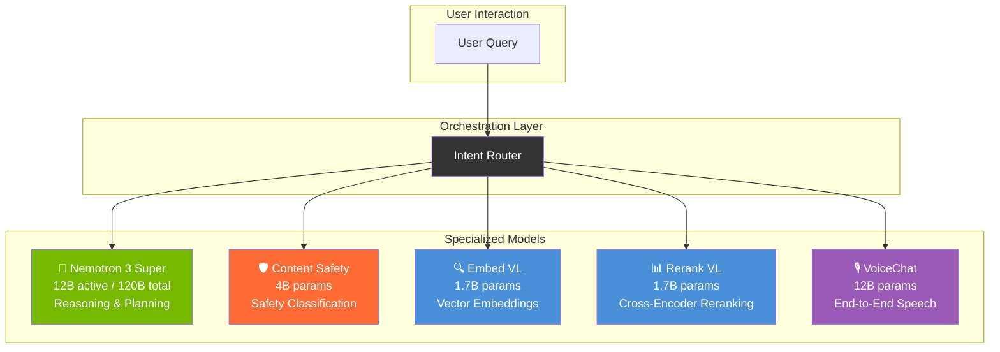
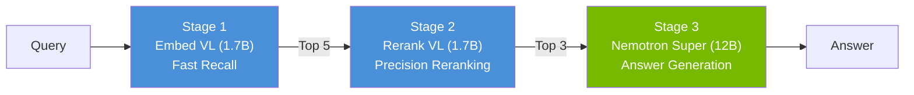
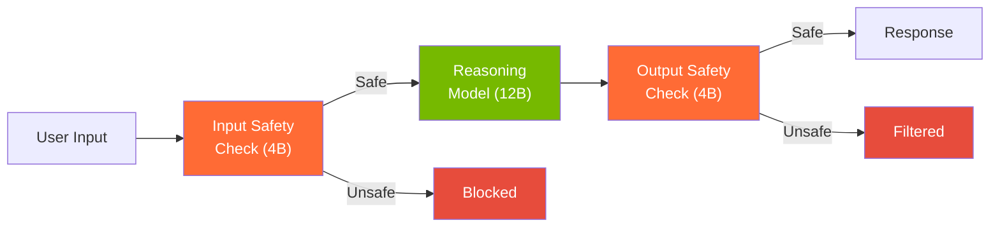
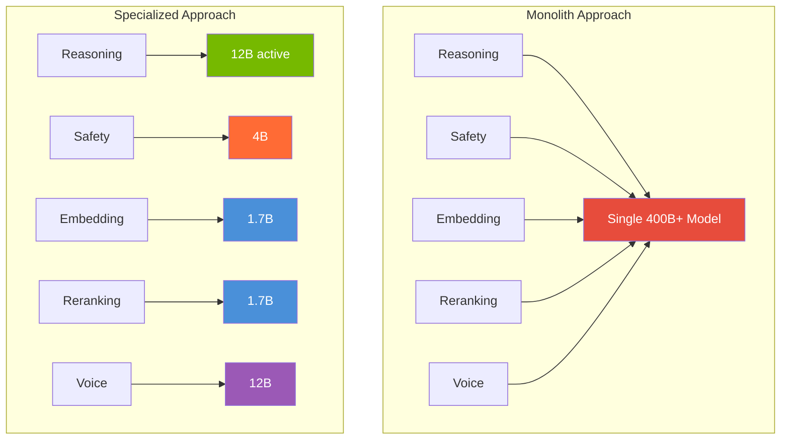
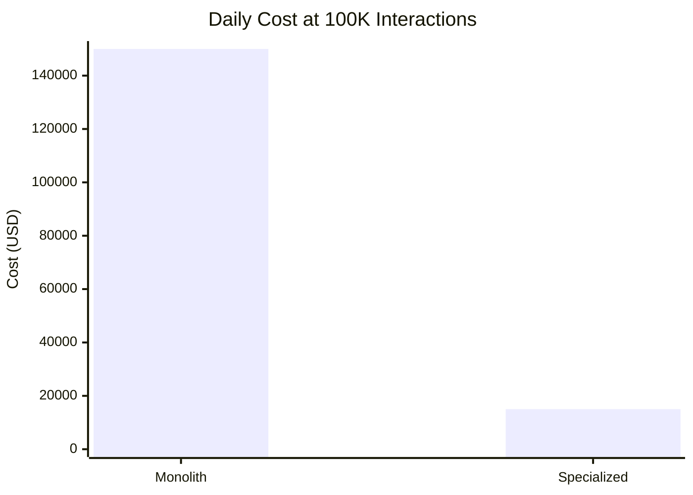

# Architecture Diagrams

## 1. Specialized Agent Stack

```mermaid
graph TB
    subgraph "User Interaction"
        U[User Query]
    end

    subgraph "Orchestration Layer"
        R[Intent Router]
    end

    subgraph "Specialized Models"
        S1["🧠 Nemotron 3 Super<br/>12B active / 120B total<br/>Reasoning & Planning"]
        S2["🛡️ Content Safety<br/>4B params<br/>Safety Classification"]
        S3["🔍 Embed VL<br/>1.7B params<br/>Vector Embeddings"]
        S4["📊 Rerank VL<br/>1.7B params<br/>Cross-Encoder Reranking"]
        S5["🎙️ VoiceChat<br/>12B params<br/>End-to-End Speech"]
    end

    U --> R
    R --> S1
    R --> S2
    R --> S3
    R --> S4
    R --> S5

    style S1 fill:#76B900,color:#fff
    style S2 fill:#FF6B35,color:#fff
    style S3 fill:#4A90D9,color:#fff
    style S4 fill:#4A90D9,color:#fff
    style S5 fill:#9B59B6,color:#fff
    style R fill:#333,color:#fff
```

## 2. RAG Pipeline (Three-Stage)

```mermaid
graph LR
    Q[Query] --> E["Stage 1<br/>Embed VL (1.7B)<br/>Fast Recall"]
    E -->|Top 5| RK["Stage 2<br/>Rerank VL (1.7B)<br/>Precision Reranking"]
    RK -->|Top 3| G["Stage 3<br/>Nemotron Super (12B)<br/>Answer Generation"]
    G --> A[Answer]

    style E fill:#4A90D9,color:#fff
    style RK fill:#4A90D9,color:#fff
    style G fill:#76B900,color:#fff
```

## 3. Safety-as-a-Service Pipeline

```mermaid
graph LR
    I[User Input] --> SC1["Input Safety<br/>Check (4B)"]
    SC1 -->|Safe| RM["Reasoning<br/>Model (12B)"]
    SC1 -->|Unsafe| BL[Blocked]
    RM --> SC2["Output Safety<br/>Check (4B)"]
    SC2 -->|Safe| O[Response]
    SC2 -->|Unsafe| FL[Filtered]

    style SC1 fill:#FF6B35,color:#fff
    style SC2 fill:#FF6B35,color:#fff
    style RM fill:#76B900,color:#fff
    style BL fill:#E74C3C,color:#fff
    style FL fill:#E74C3C,color:#fff
```

## 4. Monolith vs. Specialized Comparison

```mermaid
graph TB
    subgraph "Monolith Approach"
        M[Single 400B+ Model]
        T1[Reasoning] --> M
        T2[Safety] --> M
        T3[Embedding] --> M
        T4[Reranking] --> M
        T5[Voice] --> M
    end

    subgraph "Specialized Approach"
        T6[Reasoning] --> M1["12B active"]
        T7[Safety] --> M2["4B"]
        T8[Embedding] --> M3["1.7B"]
        T9[Reranking] --> M4["1.7B"]
        T10[Voice] --> M5["12B"]
    end

    style M fill:#E74C3C,color:#fff
    style M1 fill:#76B900,color:#fff
    style M2 fill:#FF6B35,color:#fff
    style M3 fill:#4A90D9,color:#fff
    style M4 fill:#4A90D9,color:#fff
    style M5 fill:#9B59B6,color:#fff
```

## 5. Cost at Scale

```mermaid
xychart-beta
    title "Daily Cost at 100K Interactions"
    x-axis ["Monolith", "Specialized"]
    y-axis "Cost (USD)" 0 --> 150000
    bar [150000, 15000]
```
